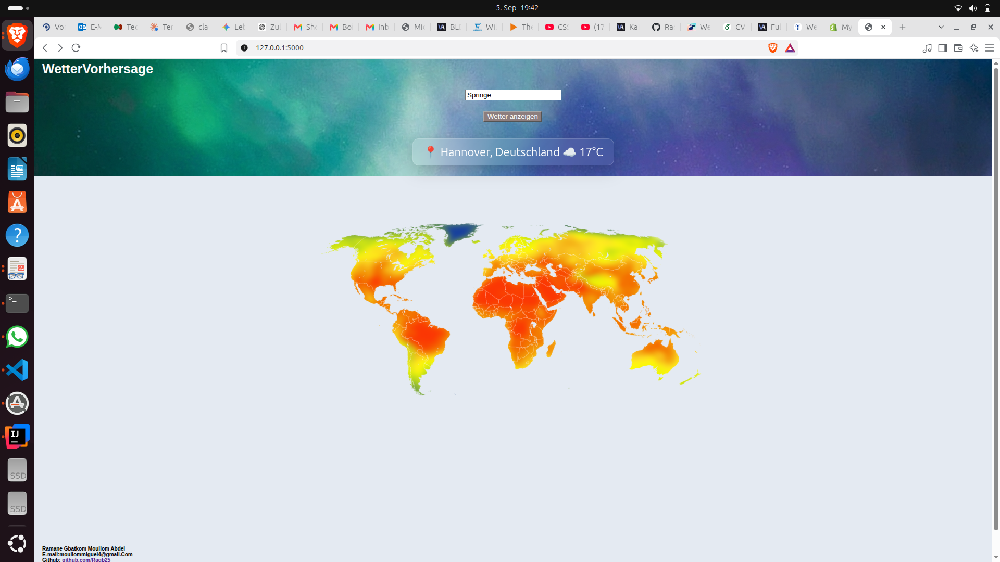
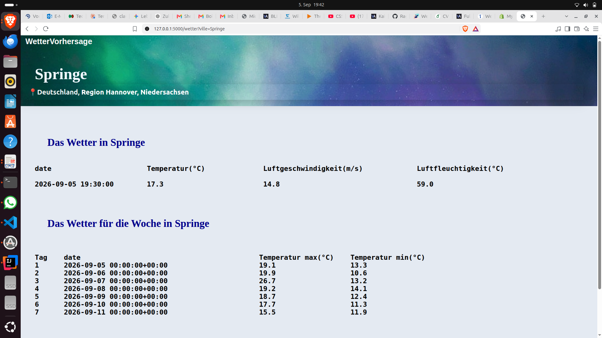

# 🌤️ Wetter Dashboard

Ein Python-Webprojekt zur Anzeige von Wetterdaten beliebiger Städte weltweit – entwickelt mit Flask und Open-Meteo.

---

## 📸 Screenshots

**Startseite**


**Wetterseite**


---

## 📋 Beschreibung

Dieses Projekt ermöglicht es, aktuelle Wetterdaten sowie eine 7-Tage-Vorhersage für jede Stadt der Welt abzurufen. Der Stadtname wird über die Nominatim API in geografische Koordinaten umgewandelt, die dann für die Wetterabfrage bei Open-Meteo genutzt werden.

---

## 🛠️ Verwendete Technologien

| Technologie | Verwendung |
|---|---|
| Python 3 | Programmiersprache |
| Flask | Webserver und Routing |
| Open-Meteo API | Wetterdaten (kostenlos, kein API-Key nötig) |
| Nominatim API | Stadtname → Koordinaten (OpenStreetMap) |
| openmeteo-requests | Open-Meteo Client |
| HTML / CSS | Frontend |

---

## ⚙️ Installation

**1. Repository klonen**
```bash
git clone https://github.com/Ragb25/Wetter_projekt.git
cd Wetter_projekt
```

**2. Abhängigkeiten installieren**
```bash
pip install flask requests openmeteo-requests requests-cache retry-requests pandas
```

**3. Anwendung starten**
```bash
python3 app.py
```

**4. Im Browser öffnen**
```
http://localhost:5000
```

---

## 🚀 Funktionen

- 🌡️ Aktuelle Temperatur, Windgeschwindigkeit und Luftfeuchtigkeit
- 📅 7-Tage-Wettervorhersage (Tagesmax und -min)
- 🗺️ Interaktive Weltkarte auf der Startseite
- 🔍 Suche nach beliebigen Städten weltweit
- 🏠 Startseite mit aktuellem Wetter in Hannover

---

## 📁 Projektstruktur

```
Wetter_projekt/
├── app.py              # Flask-Routen und Webserver
├── api.py              # API-Logik (Nominatim + Open-Meteo)
├── templates/          # HTML-Seiten
│   ├── welcome_page.html
│   └── wetter_page.html
├── static/             # CSS und statische Dateien
└── screenshots/        # Screenshots für README
    ├── startseite.png
    └── wetterseite.png
```

---

## 👤 Autor

**Ramane Gbatkom Mouliom Abdel**  
E-mail: mouliommiguel4@gmail.com  
GitHub: [github.com/Ragb25](https://github.com/Ragb25)  

Projekt erstellt im Rahmen eines Python-Selbststudiums – TU Clausthal, 2026
